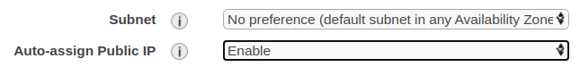
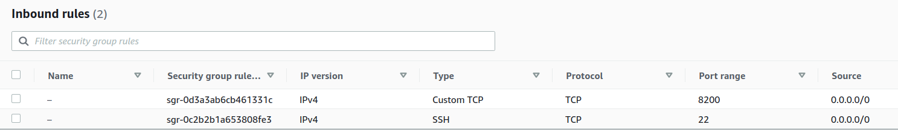
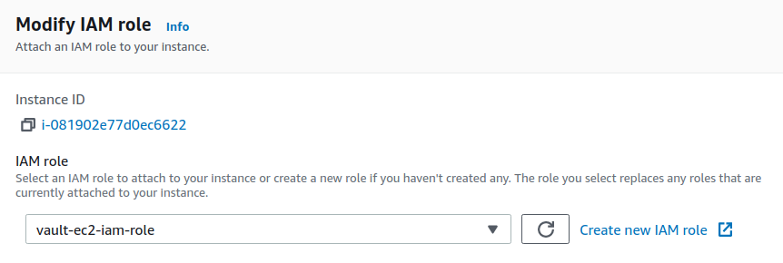
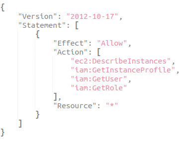

## Introduction 
This project demonstrates using the [aws iam](https://www.vaultproject.io/docs/auth/aws) authentication method to authenticate to Hashicorp vault. I'll assume familiarity with basic concepts of using vault such as [policies](https://learn.hashicorp.com/tutorials/vault/policies) and [roles](https://www.vaultproject.io/docs/auth/approle) as well as their AWS counterparts - AWS IAM role, policy and trust relationship between an IAM Role and AWS user identity. 

In my setup, vault is installed on an AWS t2.micro EC2 instance. The python script `vault-aws-auth.py` included in this repo acts as the client and can be executed on your personal computer or on AWS EC2 instance. The script creates the required roles and policies on vault, authenticates using aws auth method, writes a simple secret and then reads it back to verify it matches the secret that was written. The interaction between the client and vault occurs entirely through REST API calls to make the data exchange transparent. 

## Setup
### Vault setup
Let's first go through vault setup.
- Launch a t2.micro EC2 instance using the AWS EC2 console
- Select the Amazon Linux 2 AMI
- In "Configure Instance Details", ensure Auto-assign Public IP is set to Enable, so that a public IP is assigned to your instance

- Make sure you have the ssh key to ssh into the instance 
- Once the instance is up and running, modify the security group Inbound Rules to allow TCP traffic on port 8200, the default port used by vault

- Attach an IAM Role to the instance with the following policy attached


 
  Out of these, only GetUser and GetRole are really necessary. iam:GetUser and iam:GetRole are used to determine the AWS [IAM Unique Identifiers](https://docs.aws.amazon.com/IAM/latest/UserGuide/reference_identifiers.html#identifiers-unique-ids) corresponding to an IAM role or IAM user or when using a wildcard on the bound ARN to resolve the full ARN of the user or role.
- ssh into your ec2 instance (ec2-user is the default user on AWS) and install vault using instructions [here](https://learn.hashicorp.com/tutorials/vault/getting-started-install?in=vault/getting-started)
- Deploy vault using instructions [here](https://learn.hashicorp.com/tutorials/vault/getting-started-deploy?in=vault/getting-started). I modified the listener setting in config.hcl to ensure the vault server is accessible from outside, like this:
```angular2
listener "tcp" {
  address     = "0.0.0.0:8200"
  tls_disable = "true"
}
```

- Copy the root vault token shown during deployment. You can also create a new root token using `vault token create`
- Enable the vault secrets engine 
```angular2
vault secrets enable kv
```  
- Verify secret engine is mounted at path kv/ using `vault secrets list -detailed`

- Turn on aws iam authentication method `vault auth enable aws`

### Connecting to vault from local computer
You'll run the vault-aws-auth.py script from your local computer. Before doing so, let's confirm that you are able to connect to vault from your local computer by issuing a curl command. Try running the following from a local terminal
```angular2
 curl -H "X-Vault-Token: <your token>" -X LIST  http://<your_vault_server_public ip>:8200/v1/kv/

```
If you get some response back, you are able to reach the vault server. 

### Creating an AWS IAM Role
Vault's aws iam authentication validates an authorization request by verifying that the identity attached to an authorization request matches the IAM principal bound to the vault role being assumed in the authentication request. If you don't know what this means, I recommend reading about vault [policies](https://learn.hashicorp.com/tutorials/vault/policies), [roles](https://www.vaultproject.io/docs/auth/approle) and the [aws iam](https://www.vaultproject.io/docs/auth/aws) authentication method. 

With the above in mind, next step is to create an IAM Role that you are able to assume. This IAM role is only used to establish a caller identity and doesn't need to have any policies attached to it. It just needs to have a trust relationship to your aws user. So create a IAM role using AWS IAM console and create a trust relationship with your aws user

### Running the script
Fill in vault_settings.cfg with the following settings:
```angular2
[DEFAULT]
VAULT_ADDR = http://<your vault server public ip>:8200
VAULT_ROLE = dev_role_iam
SECRET_PATH = aws-auth-test
VAULT_ROOT_TOKEN =  <your vault root token>
AWS_IAM_ROLE = <AWS ARN created in step above>
VAULT_POLICY = aws-auth-test-rw-policy
AWS_ACCESS_KEY = <AWS ACCESS KEY for a user profile the AWS_IAM_ROLE has trust relationship with>
AWS_SECRET_KEY = <AWS SECRET KEY for a user profile the AWS_IAM_ROLE has trust relationship with>
```

Run `python vault-aws-auth.py`! The code is well commented and easy to follow. 